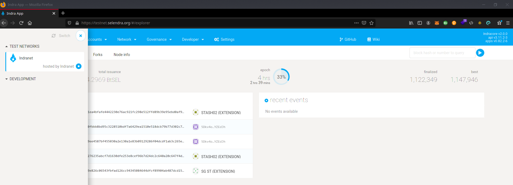
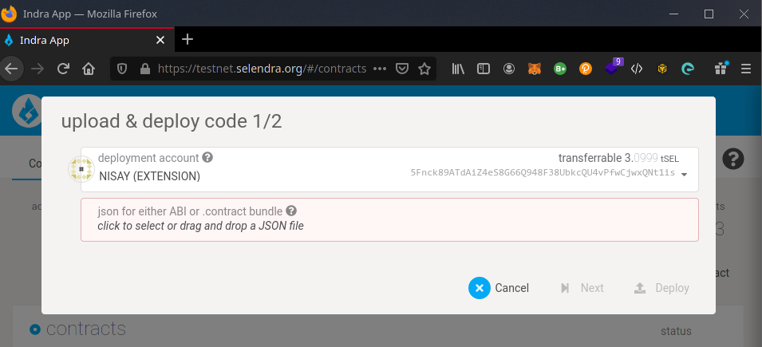
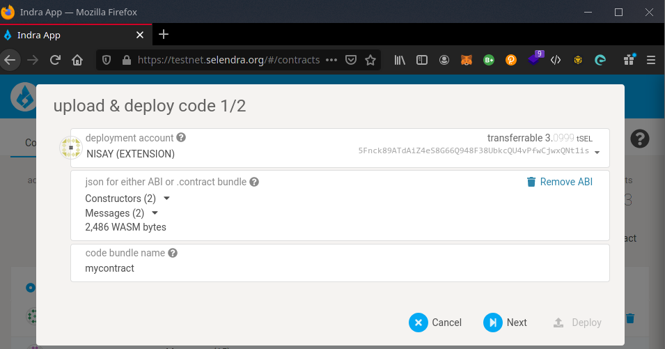
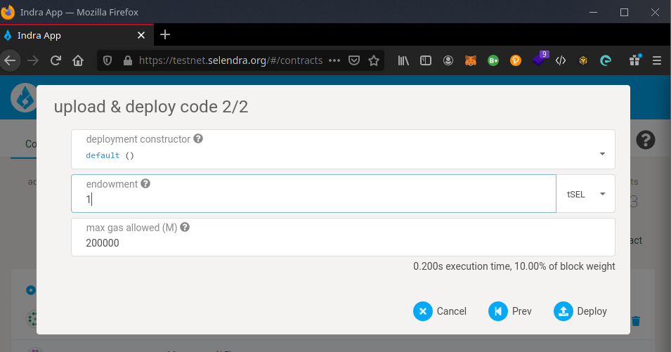
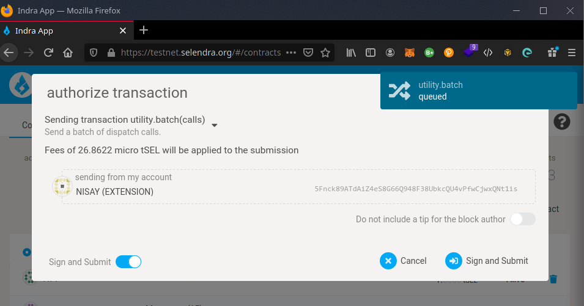
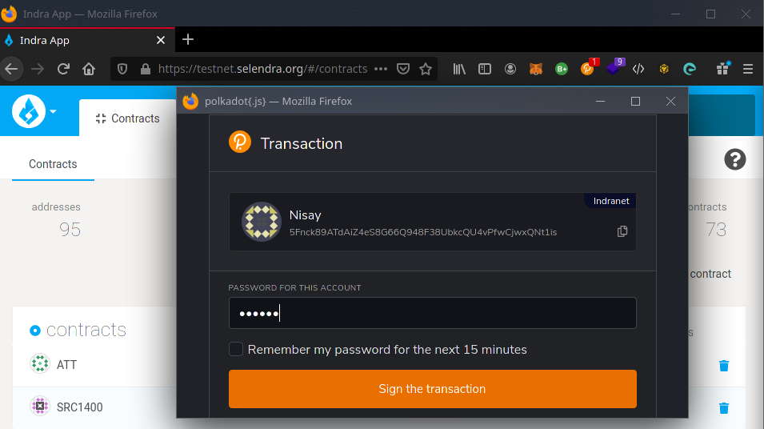
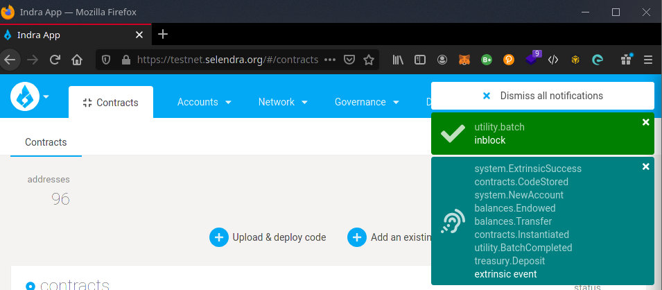
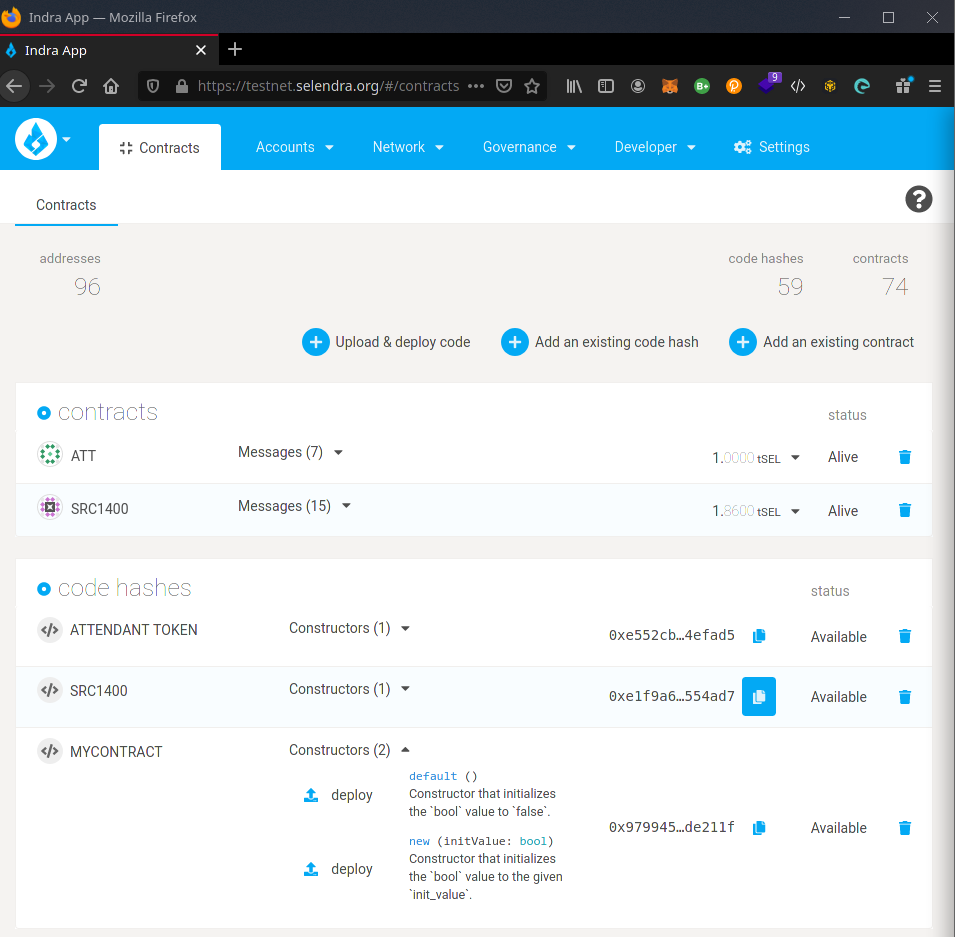
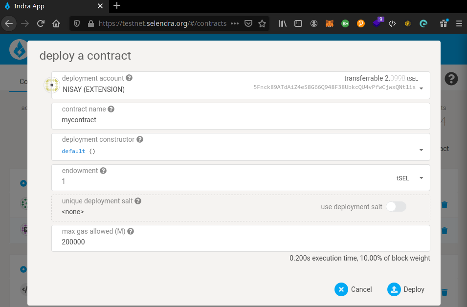
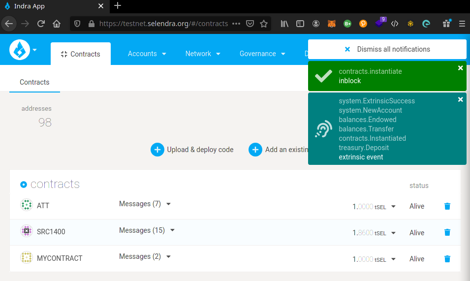

### Deploy Your Smart Contract on Selendra

Before deploying your smart contract on the Selendra Mainnet, you are recommended deploying the contract on your local development chain, and after that on the [Indranet](https://testnet.selendra.org).

First, select Indranet on the top left of the chain selection menu.

Click Contracts tab and choose Upload & deploy code.

Upload .conract bundle

We Want to Hear From You

If you have any feedback regarding deploying Smartcontract on your project, feel free to reach out through our official community at Telegram group [here](https://t.me/selendra_sel).